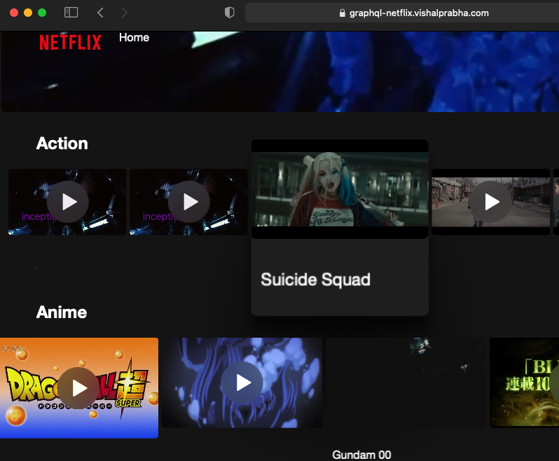

<!--- STARTEXCLUDE --->
# 🎬 A Simple Netflix Clone using Astra DB and GraphQL

&nbsp;

 

## 📝 Description
Developed a Netflix homepage clone with **ReactJS** running on **Astra DB** that leverages a **GraphQL API** with *paging* and *infitine* scrolling features. The project was an outcome of a workshop focused on leveraging Astra DB(cloud-native Cassandra application development) with GraphQL and deployment on *netlify*.

 

## 🎯 Objectives

* Leverage DataStax Astra DB and GitPod
* Learn **GraphQL API** and how to use it with a database to create the tables and navigate the data.
* Learn about **paging** and **infinite scrolling** in web ui
* Deploy a Netflix clone to production using Netlify

 

## 📋 Outcome

 

## ✍ Acknowledgements

* [DataStax](https://www.datastax.com/)
* [Netlify](https://app.netlify.com/)
* [AstraDB](https://www.datastax.com/products/datastax-astra)
* [Ania's Netflix Video](https://www.youtube.com/watch?v=g8COh40v2jU&ab_channel=CodewithAniaKub%C3%B3w)